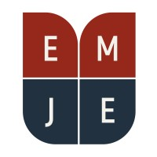

# 📢 Session 01

### Date: 10/11/2024

 <!-- Placeholder for your actual logo or relevant image -->

---

## 🌟 Introduction

Welcome, team! We’re here to create something impactful together—a centralized workspace using this **Docusaurus Website** for **EMJE Club**. This website will be:

- **🎓 Our Learning Hub**: Tutorials, coding guides, and walkthroughs for all.
- **📝 A Blog Platform**: Share insights and showcase our experiences through blogs.
- **🔗 A Collaborative Website Workspace**: Plan, structure, and document our projects efficiently.

Our goals? **Skill-building** and **community contribution**! This platform will help us grow, document our progress, and create something useful for all students, forming a history of our collective achievements.

---

## 🔑 Website Vision & Purpose

### 1. 📘 **Educational Content**

Create tutorials and walkthroughs on diverse web dev topics to serve as learning materials and valuable resources for the community.

### 2. 🖊️ **Blog Hub**

Share blog posts about our development journey, insights, tips, and challenges. These blogs can also be posted on LinkedIn to showcase our growth as developers.

### 3. 🛠️ **Workspace & Project Hub**

Organize tasks, track project progress, and collaborate seamlessly within the website to keep our work streamlined and impactful.

---

## 📋 How We’ll Work Together

### ✍️ Content Creation

- **Tutorials**: Each team member will create step-by-step tutorials or guides on selected topics, covering fundamentals to advanced concepts.
- **Blogs**: Write engaging blog posts that share our web dev journey, tips, and knowledge, which can also be shared on LinkedIn for broader visibility.

---

### 👥 Project Coordination

- **🗓️ Weekly Meetings**: Set aside time weekly to discuss our progress, tackle challenges, and brainstorm fresh ideas.
- **📄 Workspace Updates**: Each member will update their project status, tasks, and resources directly on our workspace website.
- **🔍 Review Process**: We’ll review each other’s tutorials and blogs to ensure quality and provide constructive feedback.

---

### 🎯 Skill-Building Strategy

- **💡 Skill Challenges**: Take on mini-projects and challenges regularly to sharpen specific skills like responsive design, frameworks, and API integration.
- **🤝 Code Reviews & Pair Programming**: Collaboratively review code, discuss alternative approaches, and build our problem-solving skills as a team.

---

Let’s make **EMJE Club** a shining example of **web development excellence** for our community! 🚀
